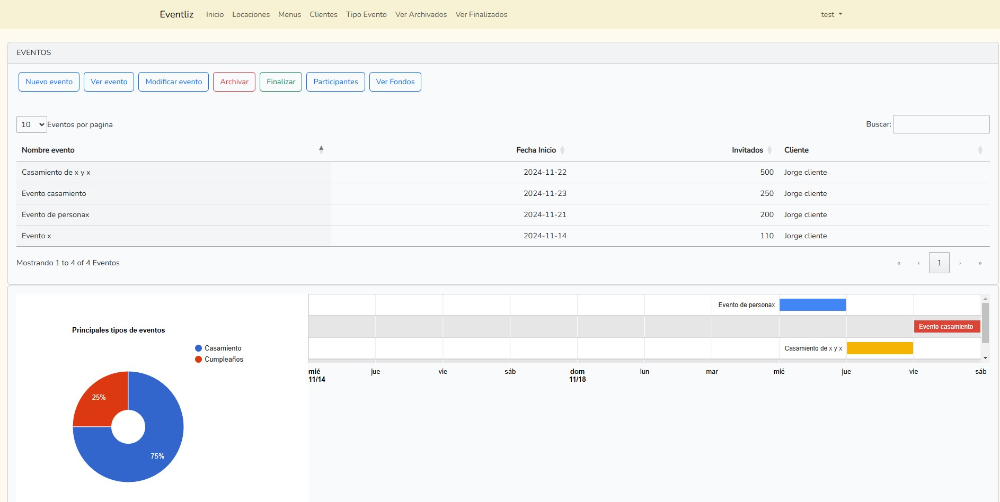
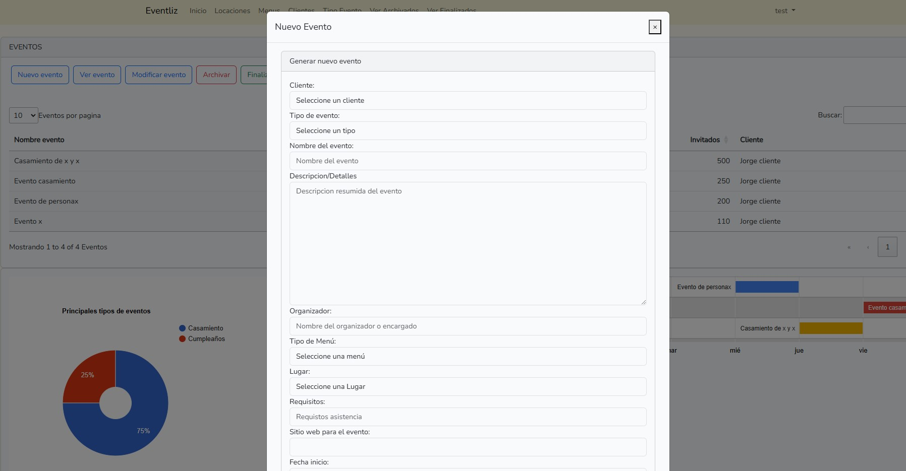
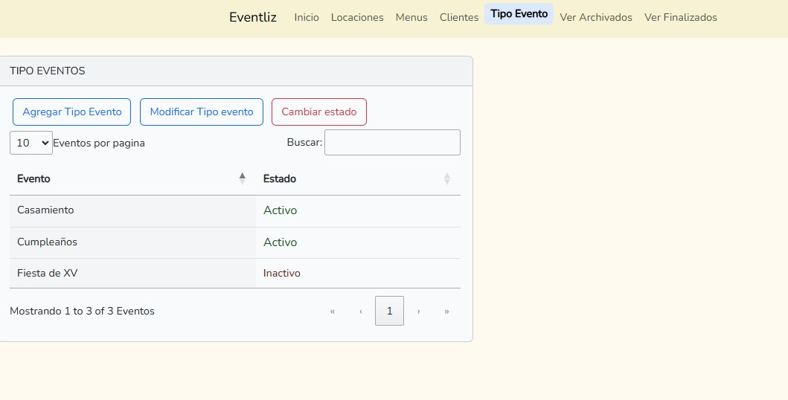
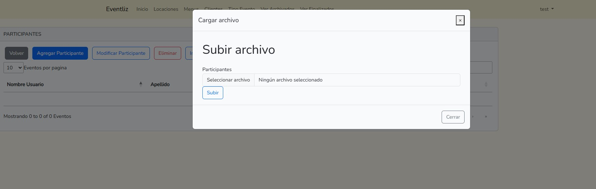

# Eventliz

# Proyecto de Gestión de Eventos

Este proyecto es una aplicación de gestión de eventos que permite crear, organizar y administrar diferentes datos de un evento, como su flujo de fondos, participantes, locación, entre otros. Construido con Laravel, el sistema también proporciona herramientas para facilitar la interpretación de datos y simplificar la administración.

## Características Principales

- **Creación de Eventos**: Configura y detalla los eventos con información como fecha, cliente, tipo de evento, tipo de menú, locación, requisitos específicos, horarios, y otros detalles.
- **Gestion de participantes**: Es posible agregar los nombres de los participantes de un evento, manualmente o desde un archivo excel.
- **Gestión del Estado del Evento**: Clasificación de eventos en estados como "Activo", "Archivado" o "Finalizado" para facilitar su seguimiento.
- **Flujo de Fondos**: Módulo para gestionar las finanzas relacionadas con cada evento, incluyendo ingresos y egresos.
- **Módulos Paramétricos**:
  - Clientes
  - Locaciones
  - Tipos de Menú
  - Tipos de Evento
- **Gráficos y Visualización de Datos**: Uso de gráficos para mejorar la presentación y el análisis de datos relacionados con los eventos.

## Tecnologías Utilizadas

Este proyecto fue desarrollado en **Laravel** y utiliza las siguientes herramientas y bibliotecas:

- **Frontend**:
  - jQuery
  - JavaScript
  - Bootstrap
  - DataTables para tablas dinámicas
  - SweetAlert para alertas interactivas
  - Google Charts para gráficos y visualización de datos

- **Backend**:
  - Laravel con Sanctum para autenticación segura

## Requisitos Previos

- **PHP** 8.x
- **Composer**
- **Node.js** y **npm** (para gestionar frontend)
- **MySQL**

## Imagenes

**Vista del inicio**

**Creacion de un evento**

**Ejemplo de parametrico tipos de eventos**

**Carga de participantes en excel**

## About Laravel

Laravel is a web application framework with expressive, elegant syntax. We believe development must be an enjoyable and creative experience to be truly fulfilling. Laravel takes the pain out of development by easing common tasks used in many web projects, such as:

- [Simple, fast routing engine](https://laravel.com/docs/routing).
- [Powerful dependency injection container](https://laravel.com/docs/container).
- Multiple back-ends for [session](https://laravel.com/docs/session) and [cache](https://laravel.com/docs/cache) storage.
- Expressive, intuitive [database ORM](https://laravel.com/docs/eloquent).
- Database agnostic [schema migrations](https://laravel.com/docs/migrations).
- [Robust background job processing](https://laravel.com/docs/queues).
- [Real-time event broadcasting](https://laravel.com/docs/broadcasting).

Laravel is accessible, powerful, and provides tools required for large, robust applications.

